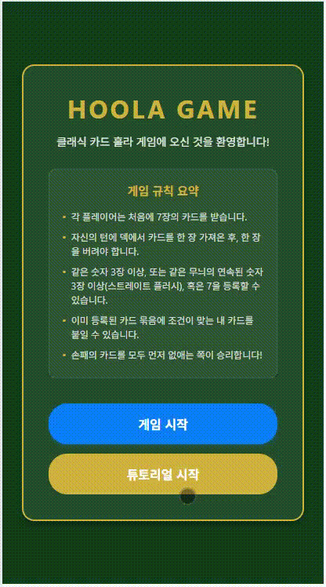
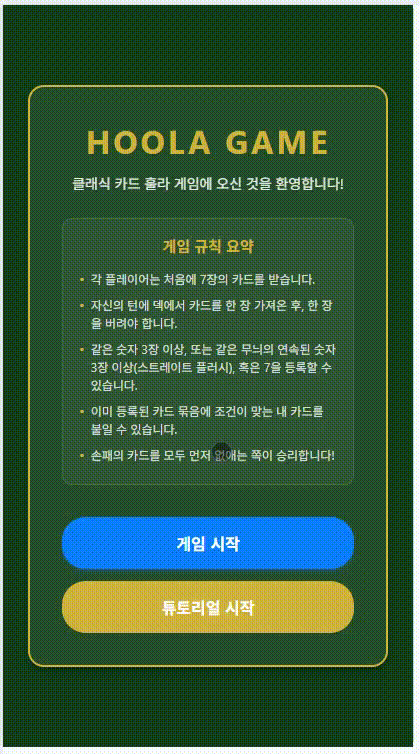

# MyHulaGame 

React Native와 Expo로 제작된 싱글 플레이어 훌라(Hula) 카드 게임 모바일 애플리케이션입니다.  
리액트 네이티브 입문 프로젝트로, 모바일 UI와 스마트 AI 대전 기능, 그리고 가이드 튜토리얼을 제공합니다.

---

## 시작 가이드 

이 프로젝트를 로컬 환경에서 실행하는 방법입니다.

### 1. 필수 프로그램 설치
이 프로젝트를 실행하려면 **Node.js**가 설치되어 있어야 합니다.

### 2. 프로젝트 의존성 설치
터미널에서 아래 명령어를 실행하여 필요한 패키지를 설치합니다.
```bash
npm install
```

### 3. 개발 서버 실행
설치가 완료되면 개발 서버를 작동시킵니다.
```bash
npx expo start
```

### 4. 앱 실행 방법
개발 서버를 켜면 터미널에 QR 코드가 나타납니다.
* **Android / iOS 기기**: 모바일 기기에 **Expo Go** 앱을 다운로드하고 카메라(iOS) 또는 Expo Go 앱 내부의 QR 스캐너(Android)로 화면의 QR 코드를 스캔하세요.
* **웹 브라우저**: 터미널 화면에서 `w` 키를 누르거나, 웹 디렉토리 상태로 빌드하여 브라우저에서 테스트할 수 있습니다.
* **에뮬레이터**: Android Studio가 실행 중이면 `a` 키, Xcode가 실행 중이면 `i` 키를 눌러 에뮬레이터에서 실행할 수 있습니다.

---

## ✨ 주요 기능 (Key Features)

* **AI 대전**: 플레이어의 행동에 맞추어 카드를 등록(Meld)하고 버리는 지능형 상대 AI.
* **가이드형 튜토리얼**: 훌라의 기본 규칙(등록, 붙이기, 땡큐 등)을 단계별로 빠르게 학습할 수 있는 프리셋 기반의 튜토리얼 모드.
* **모바일 UI**: 모바일 화면에 맞춘 직관적인 액션 패널과 카드 드래그/선택 인터페이스.

---

## 게임 플레이 영상
### 튜토리얼 영상

### 실제 게임 플레이 영상

---

## 📂 폴더 구조 (Project Structure)

```text
MyHulaGame/
├── app/                            # 화면 및 라우팅 설정 (Expo Router)
│   ├── index.tsx                   # 메인 게임 화면 및 루프 제어 (게임 핵심 컴포넌트)
│   ├── modal.tsx                   # 설정 또는 정보 안내용 모달 예시 화면
│   └── _layout.tsx                 # 기본 앱 레이아웃 및 테마/폰트 로드
├── components/                     # UI 컴포넌트
│   ├── ActionPanel.tsx             # 플레이어 조작 버튼 패널 (등록, 붙이기, 버리기, 땡 등)
│   ├── BoardArea.tsx               # 버려진 카드 더미 및 덱(카드 배분) 영역
│   ├── GameOverScreen.tsx          # 게임 종료 시 최종 결과 화면
│   ├── MainMenuScreen.tsx          # 메인 메뉴 및 모드 선택 화면
│   ├── MeldsContainer.tsx          # 플레이어들이 등록한 족보(Meld) 배치 및 붙이기 타겟 영역
│   ├── OpponentCard.tsx            # 상대방의 남은 패 개수 및 상태 표시 컴포넌트
│   ├── PlayerCard.tsx              # 플레이어가 소지한 카드 개별 렌더링 및 드래그 처리
│   ├── TutorialCompleteModal.tsx   # 튜토리얼 완료 축하 모달
│   └── TutorialGuideHeader.tsx     # 튜토리얼 진행 시 상단 실시간 가이드 가이드바
├── constants/                      # 게임 설정 및 프리셋
│   ├── game.ts                     # 카드의 랭크(A~K) 정수 매핑 및 무늬 우선순위 상수
│   ├── theme.ts                    # 테마 색상(메인 그린, 포인트 골드 등) 및 레이아웃 규격
│   └── tutorialPresets.ts          # 튜토리얼 단계별 시나리오 프리셋 카드 데이터
├── utils/                          # 핵심 로직 및 헬퍼 함수
│   ├── hulaAI.ts                   # 훌라 규칙 검사(등록/붙이기 조건) 및 컴퓨터 AI 판단 로직
│   └── hulaLayout.ts               # 카드 드래그 시 가장 가까운 슬롯/등록지를 판별하는 좌표 연산
└── types/                          # TypeScript 타입 정의
    └── game.ts                     # Card 인터페이스 및 GamePhase 타입 정의
```

---

## 🛠 기술 스택 (Tech Stack)

* **Framework**: React Native, Expo (SDK 54)
* **Language**: TypeScript
* **Navigation**: Expo Router (File-based Routing)
* **Styling**: React Native StyleSheet
